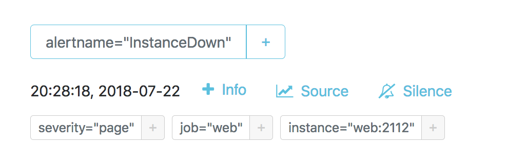

# Alertmanager sandbox

In this sandbox, a Prometheus [Alertmanager](https://github.com/prometheus/alertmanager) handles alerts thrown by a running Prometheus instance. The Alertmanager in this example is configured with one alert (specified in an [`alert.rules`](./prometheus/alert.rules) file) that Prometheus fires whenever the [`hello`](./hello/main.go) service—a simple web service—is down for more than 10 seconds. If Prometheus alerts the Alertmanager that the `hello` service is down, it will `POST` a webhook to the [`webhook`](./webhook/main.go) service, which will then log the alert sent by the Alertmanager to stdout.

## Usage

To start the sandbox:

```bash
# In the foreground
make run # docker-compose up --build

# In detached mode
make run-detached # docker-compose up --build --detach
```

This will start up five services:

Service | Description
:-------|:-----------
`prometheus` | A Prometheus instance that's [configured](./prometheus/alert.rules) to alert the Alertmanager whenever the `hello` web service has been down for more than 10 seconds
`alertmanager` | An Alertmanager instance that's configured to `POST` an alert message to the `webhook` service whenever Prometheus alerts Alertmanager that the `hello` service is down
`amtool` | [amtool](https://github.com/prometheus/alertmanager#amtool) is a CLI utility for interacting with the Alertmanager. This service is a utility container that enables you to run amtool against the Alertmanager instance included in the sandbox.
`hello` | A simple [web service](./hello/main.go) written in Go. The `hello` web service has just two endpoints: a `/hello` endpoint that returns a `{"hello":"world"}` JSON object and a `/metrics` endpoint for Prometheus instrumentation
`webhook` | A simple [web service](./webhook/main.go) written in Go. The `webhook` web service has just one `/alert` endpoint to which Alertmanager alerts are `POST`ed

## Creating an alert

When you first start up the containers, there's no alert-worthy behavior because the `hello` service is running as expected. You can verify this in the [Prometheus expression browser](http://localhost:9090/graph) using the [`up{job="hello"}`](http://localhost:9090/graph?g0.range_input=1h&g0.expr=up%7Bjob%3D%22hello%22%7D&g0.tab=1) expression, which should have a value of 1.

To create an alert, stop the service:

```bash
docker-compose stop hello
```

Wait about 10 seconds and you should see something like this in the Docker Compose logs:

```
webhook_1       | 2018/07/23 19:31:28 Webhook received: {"receiver":"webhook","status":"firing","alerts":[{"status":"firing","labels":{"alertname":"InstanceDown","instance":"hello:2112","job":"hello","severity":"page"},"annotations":{"description":"Instance hello:2112 of job hello has been down for more than 30 seconds","summary":"Instance hello:2112 down"},"startsAt":"2018-07-23T19:31:18.893055177Z","endsAt":"0001-01-01T00:00:00Z","generatorURL":"http://e192da4eb26f:9090/graph?g0.expr=up%7Bjob%3D%22hello%22%7D+%3D%3D+0\u0026g0.tab=1"}],"groupLabels":{"alertname":"InstanceDown"},"commonLabels":{"alertname":"InstanceDown","instance":"hello:2112","job":"hello","severity":"page"},"commonAnnotations":{"description":"Instance hello:2112 of job hello has been down for more than 30 seconds","summary":"Instance hello:2112 down"},"externalURL":"http://98c322df76cb:9093","version":"4","groupKey":"{}:{alertname=\"InstanceDown\"}"}
```

This indicates that Alertmanager has `POST`ed a webhook to the running [`webhook`](./webhook/main.go) service. You can also read the webhook service logs directly:

```bash
docker-compose logs webhook
```

You can also see the alert in the [Alertmanager UI](http://localhost:9093/#/alerts). It should look like this:



In the Prometheus expression browser, [`up{job="hello"}`](http://localhost:9090/graph?g0.range_input=1h&g0.expr=up%7Bjob%3D%22hello%22%7D&g0.tab=1) should now have a value of 0.

## amtool

The `amtool` service can be used as a proxy for the [amtool](https://github.com/prometheus/alertmanager#amtool) CLI utility. For ease of use, you can alias `amtool` to the container:

```bash
alias amtool='docker-compose run amtool amtool'
```

Now you can use amtool commands like this:

```bash
amtool alert
```